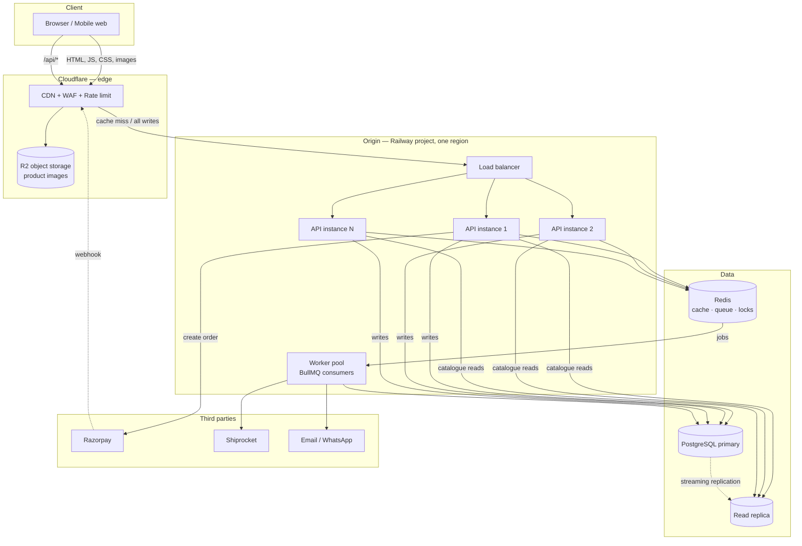
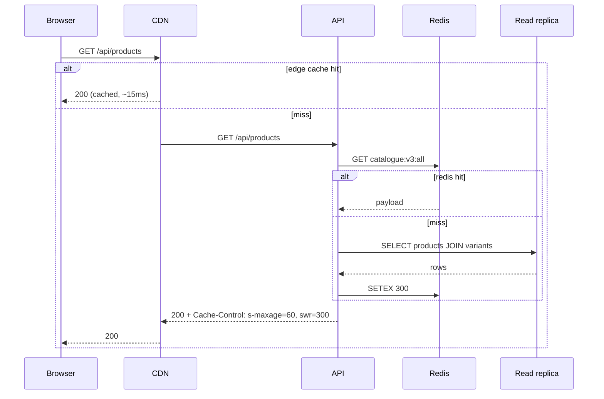
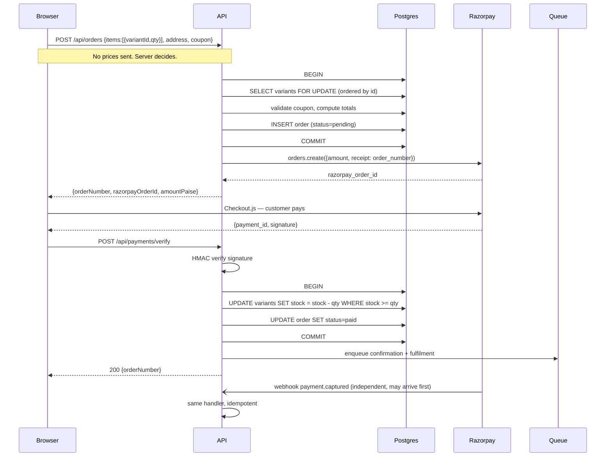

# System Architecture

How S V Home Products is put together, and why each piece is there.

---

## 1. Goals and non-goals

### Goals

| Goal | Target |
|---|---|
| Storefront availability | 99.9% — a shop that is down sells nothing |
| Catalogue page latency | p95 < 200ms at the edge, < 400ms cold |
| Checkout availability | 99.95% — this is where money is lost |
| Order durability | Zero lost paid orders. A payment that succeeds **must** produce an order. |
| Oversell rate | Zero. Never sell stock that does not exist. |
| Peak capacity | 10,000 concurrent browsers, 500 orders/minute (Stage 2, see [SCALING.md](./SCALING.md)) |

### Non-goals

Naming these keeps the design honest and stops it inflating:

- **Multi-tenant / marketplace.** One brand, one seller, one catalogue.
- **Global multi-region writes.** Customers and warehouse are both in India.
  One write region, as close to India as the host offers — see
  [DEPLOYMENT.md §3](./DEPLOYMENT.md) on region availability.
- **Real-time inventory sync with physical POS.** Stock is set by the admin.
- **Microservices.** One API service. At this order volume, splitting it buys
  operational pain and nothing else.
- **Server-side rendering framework.** Vite SPA stays. SEO is handled by
  prerendering — see §9.

---

## 2. High-level topology



**The single most important property of this diagram:** everything in the
"Origin" box is stateless and replaceable. Kill any API instance mid-request
and the next request works. All state lives in Postgres, Redis, or R2.

---

## 3. Components

### 3.1 Frontend — `frontend/`

A Vite-built React SPA. **Compiles to static files.** No Node process serves
it in production; Cloudflare Pages does, from the edge.

Consequences that matter:

- Frontend scaling is a solved problem and costs approximately nothing. A
  traffic spike on the storefront does not touch your servers.
- The frontend can be rolled back instantly and independently of the API.
- Anything secret must not be in the bundle. `VITE_`-prefixed env vars are
  **public**. The Razorpay *key id* is public and belongs here; the *key
  secret* never leaves the backend.

Internal structure:

```
frontend/src/
├─ pages/         # Route components (storefront + admin)
├─ components/    # Presentational, no data fetching
├─ features/      # Cart, checkout, catalogue — logic + hooks
├─ api/           # Typed fetch wrappers, one file per API resource
├─ context/       # ShopContext (cart only)
└─ lib/           # cn(), formatters, constants
```

Data fetching goes through TanStack Query. Not for cleverness — because
without it you write the same loading/error/refetch/stale logic in eight
pages and get it subtly wrong in three of them.

### 3.2 Backend — `backend/`

A stateless Express service in TypeScript, run with `tsx` in dev and compiled
for production. It does four things: serve JSON, talk to Postgres, talk to
Redis, and enqueue jobs.

```
backend/src/
├─ index.ts           # bootstrap, graceful shutdown
├─ app.ts             # express app — middleware chain, mountable for tests
├─ routes/            # thin: validate → call service → shape response
├─ services/          # business logic. The only layer that knows the rules.
├─ db/                # drizzle schema, client, query helpers
├─ jobs/              # queue producers + worker definitions
├─ lib/               # razorpay, redis, mailer, logger, errors
└─ middleware/        # auth, rate limit, request id, error handler
```

**Routes are thin on purpose.** A route handler validates input, calls one
service function, and formats the response. All rules — pricing, stock,
discounts, state transitions — live in `services/` where they can be tested
without HTTP.

### 3.3 Shared — `shared/`

Types and Zod schemas only. `Product`, `Order`, `CreateOrderRequest`, and the
schemas that validate them. The backend validates incoming requests with the
same schema the frontend uses to validate its forms, so the two cannot drift.

Hard rule: **no imports from `shared/` into anything with side effects.** No
database client, no React, no `process.env`. If it cannot be imported by both
a browser bundle and a Node process, it does not belong here.

### 3.4 Worker pool

Same codebase as the backend, different entrypoint. Consumes BullMQ queues:

| Queue | Jobs | Retry policy |
|---|---|---|
| `notifications` | order confirmation, shipment update, OTP | 5 attempts, exponential |
| `fulfilment` | create Shiprocket order, fetch AWB, poll tracking | 10 attempts, exponential to 1h |
| `documents` | GST invoice PDF generation, upload to R2 | 3 attempts |
| `maintenance` | cache warm, abandoned-cart sweep, stale-payment reconcile | cron, no retry |

Workers scale independently of the API. A backlog of 5,000 confirmation
emails does not slow down checkout.

### 3.5 Data stores

**PostgreSQL** is the source of truth. Everything else is derived and can be
rebuilt from it. Fronted by **PgBouncer** in transaction pooling mode — see
[SCALING.md §4](./SCALING.md) for why this is not optional once you run more
than one API instance.

**Redis** holds four kinds of things, none of them truth:

1. Catalogue cache (products, variants, recipes) — TTL 5 min, explicitly
   busted on admin write
2. Rate-limit counters — distributed, so limits are global not per-instance
3. Idempotency keys — 24h TTL
4. BullMQ queues and their job state

**R2** holds product images and generated invoice PDFs. Public read for
images, signed URLs for invoices.

---

## 4. Request flows

### 4.1 Browsing the catalogue — the hot path



Three cache layers stand between a product page and the database. At steady
state, the vast majority of catalogue traffic never reaches Postgres. This is
the difference between "handles a marketing spike" and "falls over on a
Diwali Instagram post".

`stale-while-revalidate` matters here: when the edge cache expires, the CDN
serves the stale copy instantly and refreshes in the background. Customers
never wait for a cache fill.

### 4.2 Placing an order — the critical path

This path is **not cached, never cached, and must never be cached.**



Five things in that diagram are load-bearing:

1. **The client sends no prices.** It sends variant IDs and quantities. The
   server reads current prices from the database. Otherwise anyone with
   devtools buys a ₹470 packet for ₹1.
2. **Rows are locked in a deterministic order** (sorted by variant id). Two
   concurrent carts containing the same two products in opposite order will
   deadlock otherwise. This is a real, reproducible bug, not a theoretical one.
3. **Stock decrements with `WHERE stock >= qty`.** The row count tells you
   whether it worked. A `SELECT` then `UPDATE` without this guard oversells
   under concurrency.
4. **The webhook and the client callback run the same idempotent handler.**
   Roughly one payment in twenty succeeds after the customer has closed the
   tab. Without the webhook, that money arrives with no order attached.
5. **Queue jobs are enqueued after commit**, never before. A rolled-back
   transaction must not have sent a confirmation email.

### 4.3 Admin write — cache invalidation

```
Admin edits price
  → PG UPDATE
  → bump catalogue cache version key in Redis (single INCR)
  → purge CDN cache tag "catalogue"
  → next read repopulates
```

Version-key bumping rather than key deletion: one atomic `INCR` invalidates
every derived key at once, and there is no window where half the cache is old
and half is new.

---

## 5. State and consistency

| Data | Store | Consistency | Notes |
|---|---|---|---|
| Products, variants, stock | Postgres primary | Strong | Stock reads during checkout hit the **primary**, never a replica |
| Catalogue for browsing | Redis / CDN | Eventually consistent, ≤60s | A one-minute-stale price on a listing page is acceptable; checkout re-prices from primary |
| Cart | Browser localStorage | Client-only | Stores `{variantId, qty}` only — never prices or product snapshots |
| Orders | Postgres primary | Strong | Never read from a replica in the payment path |
| Order line items | Postgres, snapshotted | Immutable | Price and name copied at purchase time. Raising a price must not alter last year's invoice. |
| Sessions | Stateless JWT cookie | — | No session store to scale or lose |

**The cart deliberately holds no prices.** The current [ShopContext.tsx](../frontend/src/context/ShopContext.tsx)
serialises the entire product object into localStorage, which means a cart
abandoned in January still shows January prices in March. Store IDs, hydrate
from the API.

---

## 6. Failure modes and degradation

Designed behaviour when a dependency dies. "Degrade, don't die."

| Failure | Behaviour | Customer impact |
|---|---|---|
| Redis down | Cache bypassed, reads go to replica; rate limiting falls back to per-instance; queue producers buffer then fail loudly | Slower catalogue. Checkout still works. |
| Read replica down | Reads fail over to primary | Higher primary load, no visible impact |
| Primary down | Storefront serves from CDN cache; checkout returns 503 with a WhatsApp fallback CTA | Browsing works, ordering does not. **This is the one to page for.** |
| Razorpay down | COD remains available; online payment shows an honest error and the WhatsApp order path | Partial checkout |
| Shiprocket down | Orders are still accepted; fulfilment jobs retry for an hour | None, until it exceeds an hour |
| Email/WhatsApp down | Jobs retry; admin dashboard flags undelivered confirmations | Delayed confirmation |
| One API instance dies | LB removes it on health check | None |

The WhatsApp order path in the existing code is not legacy cruft — it is the
**fallback of last resort** when checkout cannot complete. It stays.

---

## 7. Security posture

Summarised here, detailed in [SECURITY.md](./SECURITY.md).

- Frontend and API on the **same apex domain** (`/api/*` routed at the edge to
  the backend origin). This avoids CORS entirely and lets auth cookies be
  `HttpOnly; Secure; SameSite=Lax` — materially safer than the
  `SameSite=None` a separate `api.` subdomain would force.
- Admin auth: bcrypt + short-lived JWT in an `HttpOnly` cookie, refresh
  rotation, per-route role checks.
- Razorpay webhook signature verified before the body is parsed as trusted.
- Every mutating endpoint is rate limited by IP **and** by identity.
- Zod validation at every route boundary. No handler touches `req.body`
  directly.
- Secrets only in the backend environment. Nothing sensitive is `VITE_`.

---

## 8. Why not the alternatives

Recorded so these are not relitigated every quarter.

**Why not Next.js?** Explicitly out of scope — the existing SPA stays. The
cost is SEO, addressed in §9.

**Why not serverless functions for the API?** Postgres connection exhaustion
under concurrent invocations, cold starts on the checkout path, and a worse
story for BullMQ workers, which want a long-lived process. A long-running
Node service is simpler here.

**Why not microservices?** At a few hundred orders a day, service boundaries
add network calls, distributed transactions, and deployment coordination to
buy independent scaling nobody needs. One service, clean internal module
boundaries. Split later if a boundary ever earns it.

**Why not MongoDB?** Orders and inventory are relational and demand
transactions. Stock decrement with a conditional update in a transaction is
exactly the guarantee Postgres gives cleanly.

**Why not Prisma over Drizzle?** Drizzle is closer to SQL, has a smaller
runtime footprint, and does not need a separate query engine binary. Prisma
is a defensible choice; this one is made.

---

## 9. The SPA/SEO trade-off

Keeping the Vite SPA means product pages ship as an empty `<div id="root">`.
Google executes JavaScript, but does it slowly and unreliably, and social
previews (WhatsApp, Instagram, Facebook) **do not execute JavaScript at all** —
critical for an Indian D2C brand where WhatsApp sharing is a primary channel.

Two mitigations, both compatible with the fixed stack:

1. **Build-time prerender.** A post-build step renders each product, recipe,
   and static route to real HTML with correct `<title>`, meta description, OG
   tags, and JSON-LD `Product`/`Offer` schema. The SPA hydrates over it. The
   catalogue changes rarely; a rebuild on catalogue publish is cheap.
2. **Edge meta injection.** A Cloudflare Worker uses `HTMLRewriter` to inject
   per-URL OG tags into the shell for crawler user agents. Covers products
   created between builds.

Run both. (1) is the durable fix; (2) closes the gap between deploys.

This is a genuine cost of the stack decision, and it is worth stating plainly:
an SSR framework would make this a non-issue. The mitigation is good, not free.

---

## 10. Scaling summary

Full detail in [SCALING.md](./SCALING.md). The short version:

| Stage | Shape | Concurrent users | Monthly cost |
|---|---|---|---|
| 0 | Single Railway service, Postgres alongside | ~200 | ~₹600 |
| 1 | CDN + Railway project (api, worker, postgres, redis) × 2 instances | ~2,000 | ~₹3,000 |
| 2 | + PgBouncer, read replica, scaled workers | ~10,000 | ~₹12,000 |
| 3 | + autoscaling, partitioned orders, dedicated queue nodes | 50,000+ | ~₹45,000 |

Stage 1 assumes everything except the frontend and object storage runs in one
Railway project — see [DEPLOYMENT.md §3](./DEPLOYMENT.md). Splitting Postgres
and Redis out to managed providers (Neon, Upstash) costs roughly ₹5,000/mo
instead, and buys pooling, PITR, and branching you do not need until Stage 2.

Build Stage 1 now. The architecture above **is** Stage 3 — the later stages
add instances and managed services, they do not require rewriting anything.
That is the entire point of insisting on stateless instances and
server-authoritative pricing from day one.
