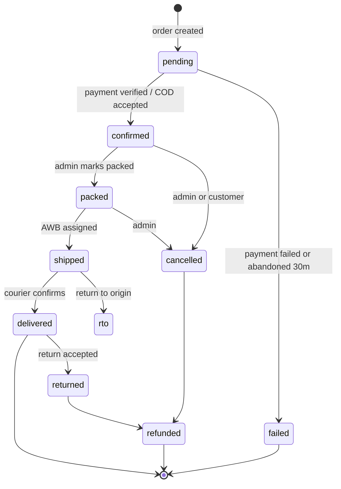

# Database Design

PostgreSQL schema, indexes, and the rules that keep the data trustworthy.

---

## 1. Non-negotiable rules

### Money is integer paise

```
₹110.50  →  11050
₹470     →  47000
```

`bigint`, never `float`, never `numeric` for arithmetic in application code,
never a decimal string. Razorpay's API works in paise, GST rounding rules are
defined on the smallest unit, and `0.1 + 0.2 !== 0.3` has cost more e-commerce
companies money than any other single bug.

Format for display at the render layer only. Column names carry the unit:
`price_paise`, `total_paise`. A column named `price` in this schema is a bug.

### Keys: internal vs public

| Kind | Type | Used in |
|---|---|---|
| Primary key | `bigint generated always as identity` | Foreign keys, joins, internal code |
| Public product id | `slug` (text, unique) | URLs — `/product/rasam-powder` |
| Public order id | `order_number` (text, unique) | Emails, invoices, customer support |

Sequential `bigint` PKs give good index locality and small foreign keys. They
never appear in a URL, so nobody can enumerate your order count. Public
identifiers are separate, human-readable, and stable.

### Snapshot what an invoice depends on

`order_items` copies the product name, weight, and price at purchase time.
Raising a price in 2027 must not alter a 2026 invoice. This is a legal
requirement under GST record-keeping, not a nicety.

### Cap the connection pool at 5–10 per instance

Railway Postgres has no built-in pooler. Two API instances with a pool of 10
each is 20 connections — comfortable. Raising the pool "for performance" is
how you reach `too many clients already`, which fails hard rather than
degrading.

Write the limit in config with a comment explaining why, or someone will
raise it. Add PgBouncer as a separate service when the instance count grows
past four — see [DEPLOYMENT.md §3](./DEPLOYMENT.md).

### Every timestamp is `timestamptz`

Store UTC. Render IST. `timestamp without time zone` is how you discover in
March that all your February orders are 5.5 hours off.

---

## 2. Schema

### `products`

| Column | Type | Notes |
|---|---|---|
| `id` | `bigint` PK | |
| `slug` | `text` unique not null | URL identity — `rasam-powder` |
| `name` | `text` not null | |
| `regional_name` | `text` | Kannada name |
| `short_description` | `text` not null | |
| `category` | `text` not null | `classics` \| `spices` \| `chutney_podi` \| `combos` |
| `category_label` | `text` not null | |
| `badge` | `text` | `Bestseller`, `Heritage Recipe`, … |
| `about` | `text` not null | |
| `ingredients` | `text[]` not null | |
| `how_to_use` | `text[]` not null | |
| `storage` | `text` not null | |
| `nutrition` | `jsonb` not null | serving size, energy, protein, carbs, fat |
| `spice_level` | `text` not null | |
| `image` | `text` not null | R2 key |
| `gallery` | `text[]` not null default `'{}'` | |
| `rating` | `numeric(2,1)` not null default 0 | Denormalised from `reviews` |
| `reviews_count` | `int` not null default 0 | Denormalised |
| `featured` | `bool` not null default false | |
| `is_signature` | `bool` not null default false | |
| `published` | `bool` not null default false | Unpublished is invisible to the storefront |
| `hsn_code` | `text` | GST classification — required before invoicing |
| `created_at` / `updated_at` | `timestamptz` | |

`rating` and `reviews_count` are denormalised deliberately: they appear on
every card in the catalogue, and recomputing an aggregate per card is an
N+1 waiting to happen. Recomputed by trigger on review approval.

### `variants`

| Column | Type | Notes |
|---|---|---|
| `id` | `bigint` PK | |
| `product_id` | `bigint` FK → products, `on delete cascade` | |
| `weight` | `text` not null | `100g`, `250g`, `500g` |
| `price_paise` | `bigint` not null | `check (price_paise > 0)` |
| `mrp_paise` | `bigint` | For strike-through pricing |
| `stock_qty` | `int` not null default 0 | `check (stock_qty >= 0)` ← **the oversell guard** |
| `sku` | `text` unique | |
| `active` | `bool` not null default true | |

Unique on `(product_id, weight)`.

**`check (stock_qty >= 0)` is the last line of defence against overselling.**
Even if application logic is wrong, the database refuses. Never drop this
constraint to make a migration easier.

### `orders`

| Column | Type | Notes |
|---|---|---|
| `id` | `bigint` PK | |
| `order_number` | `text` unique not null | `SV-2609-04312` |
| `status` | `text` not null | see §3 |
| `payment_status` | `text` not null | `pending` \| `paid` \| `failed` \| `refunded` \| `partially_refunded` |
| `payment_method` | `text` not null | `upi` \| `card` \| `netbanking` \| `cod` |
| `customer_name`, `phone`, `email` | `text` | `phone` not null |
| `address`, `landmark`, `city`, `state`, `pincode` | `text` | |
| `subtotal_paise`, `discount_paise`, `shipping_paise`, `tax_paise`, `total_paise` | `bigint` not null | |
| `coupon_code` | `text` | |
| `razorpay_order_id` | `text` unique | |
| `razorpay_payment_id` | `text` unique | Unique → webhook replay cannot double-apply |
| `razorpay_signature` | `text` | Retained for dispute evidence |
| `tracking_number`, `courier` | `text` | |
| `invoice_url` | `text` | R2 key |
| `notes` | `text` | Customer note |
| `admin_notes` | `text` | Internal, never exposed |
| `created_at`, `paid_at`, `shipped_at`, `delivered_at`, `cancelled_at` | `timestamptz` | |

`razorpay_payment_id` being **unique** is what makes webhook processing
idempotent at the database level rather than only in application logic. When
Razorpay delivers the same event twice — and it will — the second insert
fails on the constraint and the handler treats that as success.

### `order_items`

| Column | Type | Notes |
|---|---|---|
| `id` | `bigint` PK | |
| `order_id` | `bigint` FK → orders, cascade | |
| `product_id`, `variant_id` | `bigint` FK, **`on delete set null`** | |
| `product_name`, `weight`, `sku` | `text` not null | Snapshot |
| `unit_price_paise` | `bigint` not null | Snapshot |
| `quantity` | `int` not null, `check (> 0)` | |
| `line_total_paise` | `bigint` not null | Snapshot |
| `hsn_code` | `text` | Snapshot, for the invoice |

`on delete set null` on the product FK, not cascade: deleting a discontinued
product must never delete order history.

### `coupons`

| Column | Type | Notes |
|---|---|---|
| `code` | `text` PK | Stored uppercase |
| `type` | `text` not null | `percent` \| `flat` |
| `value` | `int` not null | Percent, or paise for flat |
| `min_order_paise` | `bigint` not null default 0 | |
| `max_discount_paise` | `bigint` | Caps a percent coupon |
| `starts_at`, `expires_at` | `timestamptz` | |
| `usage_limit` | `int` | Global cap |
| `used_count` | `int` not null default 0 | |
| `per_customer_limit` | `int` | Enforced by phone |
| `active` | `bool` not null default true | |

Coupon codes are currently hardcoded in the frontend bundle
([ShopContext.tsx:181](../frontend/src/context/ShopContext.tsx)) — publicly
readable and trivially tampered with. This table is where they move. Discounts
are computed server-side, always.

`used_count` increments in the same transaction as the order. `usage_limit`
enforced with a conditional update, exactly like stock:
`UPDATE coupons SET used_count = used_count + 1 WHERE code = $1 AND (usage_limit IS NULL OR used_count < usage_limit)`.

### `customers`

Not needed for v1 (guest checkout — see [ROADMAP.md](./ROADMAP.md)), but the
table exists from the start so orders can be back-linked later:

| Column | Type |
|---|---|
| `id` | `bigint` PK |
| `phone` | `text` unique not null |
| `name`, `email` | `text` |
| `created_at` | `timestamptz` |

`orders.customer_id` is nullable. When accounts ship, a backfill matches on
phone and links historical orders. No migration pain later, one nullable
column now.

### `reviews`

`id`, `product_id`, `name`, `location`, `rating` (1–5 check), `comment`,
`order_id` (nullable — non-null means verified purchase), `approved` (default
false), `created_at`.

Reviews are **approval-gated**. An open review form on a food product is a
spam magnet.

### `recipes`

Mirrors the current [recipes.ts](../frontend/src/data/recipes.ts): `slug`,
`title`, `subtitle`, `prep_time`, `cook_time`, `servings`, `difficulty`,
`image`, `description`, `paired_product_id`, `ingredients[]`,
`instructions[]`, `chef_tip`, `published`.

### `admin_users`

`id`, `email` unique, `password_hash` (bcrypt cost 12), `role`
(`owner` \| `staff`), `last_login_at`, `active`.

### `audit_log`

`id`, `admin_user_id`, `action`, `entity_type`, `entity_id`, `before` jsonb,
`after` jsonb, `ip`, `created_at`.

Every admin mutation writes a row. When a price is wrong or stock vanished,
this is the only thing that answers "who changed what, and when". Cheap to
write, impossible to reconstruct after the fact.

### `webhook_events`

`id`, `provider`, `event_id` unique, `payload` jsonb, `processed_at`, `error`.

Insert before processing. The unique constraint on `event_id` makes duplicate
delivery a no-op, and the retained payload lets you replay a failed webhook
instead of reconstructing it from Razorpay's dashboard.

---

## 3. Order state machine



Transitions are enforced in the service layer, not by trust. An illegal
transition (`delivered` → `pending`) throws. Every transition writes to
`audit_log`.

**Stock effects:** decremented on `pending → confirmed`. Restored on
`cancelled`, `failed`, `rto`, and `returned`. There is exactly one function in
the codebase that changes `stock_qty`, and every path goes through it.

---

## 4. Indexes

Add these with the schema, not after the first slow query.

```sql
-- Catalogue (the hot read path)
create index on products (published, featured) where published;
create index on products (category) where published;
create unique index on products (slug);
create index on variants (product_id) where active;

-- Search — trigram, so partial matches work
create extension if not exists pg_trgm;
create index on products using gin (name gin_trgm_ops);

-- Admin order list
create index on orders (created_at desc);
create index on orders (status, created_at desc);
create index on orders (phone);
create unique index on orders (order_number);
create unique index on orders (razorpay_payment_id) where razorpay_payment_id is not null;

-- Joins
create index on order_items (order_id);
create index on order_items (product_id);

-- Reviews
create index on reviews (product_id, approved) where approved;
```

Partial indexes (`where published`, `where approved`) are meaningfully smaller
than full ones here, because the filtered-out rows are a large fraction and
are never queried on this path.

---

## 5. Migrations

Drizzle Kit. Generated, reviewed by a human, committed, applied in CI.

**Rules:**

1. **Migrations are forward-only in production.** Rolling back a migration
   that has already touched live data is how data is lost. Fix forward.
2. **Expand → migrate → contract** for anything breaking. Add the new column,
   backfill, ship code that writes both, ship code that reads new, then drop
   the old — across separate deploys. Never in one.
3. **No blocking DDL on large tables.** `CREATE INDEX CONCURRENTLY`. Adding a
   `NOT NULL` column with a default rewrites the table on older Postgres —
   add nullable, backfill in batches, then add the constraint.
4. **Every migration is tested against a restored production dump** before it
   runs on production.
5. **Seed data is not a migration.** `backend/src/db/seed.ts` is idempotent
   and separate.

---

## 6. Seeding from the existing code

The current catalogue lives in
[products.ts](../frontend/src/data/products.ts) (520 lines, 11 products),
[recipes.ts](../frontend/src/data/recipes.ts), and
[siteData.ts](../frontend/src/data/siteData.ts).

One-time process:

1. Upload every image in `public/images/` to R2, record the keys
2. Run the seed script — reads the existing TypeScript arrays, maps
   rupees → paise, writes `products`, `variants`, `recipes`, `reviews`
3. Verify counts: 11 products, 30 variants, 5 recipes
4. Set an opening `stock_qty` per variant (the current data only has a
   boolean `inStock`, so this is a manual decision per SKU)
5. Delete `frontend/src/data/` and the duplicated `frontend/src/assets/images/`

Keep the seed script afterwards — it is how staging gets realistic data.

---

## 7. Backups

| What | Frequency | Retention | Verified |
|---|---|---|---|
| **Logical dump to R2** | **Hourly** | 7 days hourly, 30 days daily | **Monthly restore drill** |
| Railway snapshot | Daily | Provider default | Provider-managed |
| Pre-migration dump | Per migration | 7 days | Before every schema change |

**The hourly dump is the primary recovery mechanism, not a backstop.**

Railway Postgres is a container with a volume, so there is no
point-in-time recovery to an arbitrary second — snapshots are daily. Without
hourly dumps, a mid-afternoon disaster loses every order placed that day.

This is cheap precisely because the database is small: under 1GB for years at
this order volume, so a `pg_dump` takes seconds and the storage cost on R2 is
negligible. Run it as a cron job on the worker service.

**The dumps go to R2 — a different vendor from Railway.** This is what makes
running everything in one Railway project acceptable: a deleted project or a
compromised account cannot take the backups with it. Backups stored inside the
system they protect are not backups.

An unverified backup is not a backup either. The monthly drill — restore a
dump into a scratch database and run the test suite against it — is the only
thing that turns a hopeful assumption into a fact.
