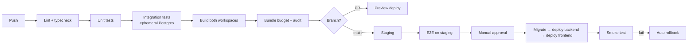

# Deployment

Environments, pipeline, and what to do when it breaks.

---

## 1. Environments

| Env | Frontend | Backend | Database | Purpose |
|---|---|---|---|---|
| Local | `vite dev` :5173 | `tsx watch` :4000 | Docker Postgres + Redis | Development |
| Preview | Pages preview URL | Per-PR backend | Shared branch DB | PR review |
| Staging | `staging.svhomeproducts.com` | Railway `staging` env | Own database, production-shaped, anonymised | Pre-release verification |
| Production | `svhomeproducts.com` | Railway `production` env | Railway Postgres + hourly dumps to R2 | Live |

**Staging uses Razorpay test keys. Production uses live keys. There is no
environment where these mix.**

Staging data is a restored production dump with PII anonymised — names, phones,
emails, addresses replaced. Realistic shape, no real customer data on a box
with looser access.

---

## 2. Local development

```bash
npm install                      # workspace root — installs all three
docker compose up -d             # postgres + redis
npm run db:migrate -w backend
npm run db:seed -w backend
npm run dev                      # frontend :5173 + backend :4000 concurrently
```

Vite proxies `/api` → `localhost:4000` in dev, so the frontend uses the same
relative URLs as production. No environment-specific base URL, no CORS branch
that only exists in development.

`.env` files: `frontend/.env.local` (`VITE_` only, all public),
`backend/.env` (everything sensitive).

---

## 3. Hosting

| Component | Service | Why |
|---|---|---|
| Frontend | Cloudflare Pages | Static at the edge, effectively free, instant rollback |
| CDN / WAF / rate limit | Cloudflare | Same zone as Pages, one place for routing rules |
| Backend, worker, Postgres, Redis | **Railway — one project** | Private networking between all four, one bill, one dashboard |
| Object storage | Cloudflare R2 | No egress fees, and a **different vendor from the backups' source** |

### Railway project layout

```
Railway project: sv-home-products
├── service: api        backend/ — node dist/index.js
├── service: worker     backend/ — node dist/worker.js
├── service: postgres   + volume
└── service: redis      + volume

environments: production · staging
```

**One project, four services.** These are different things and the
distinction is the whole point:

- **One project** is the private-network boundary. Services inside it reach
  each other over internal DNS (`postgres.railway.internal`) with no public
  internet hop, no per-connection TLS handshake, and sub-millisecond latency.
  Split them across projects and that benefit is gone.
- **Separate services, never one container.** Node, Postgres, and Redis in a
  single image means a deploy restarts your database, nothing scales
  independently, and an API memory spike takes down storage.
- **The worker is its own service** — same repository, different start
  command. A backlog of 5,000 confirmation emails must not compete for CPU
  with checkout.

Four things that are easy to get wrong:

1. **Same region for every service.** Private networking requires it, and a
   cross-region hop between API and database costs more than anything else on
   this list.
2. **Use the internal hostnames**, not the public `*.railway.app` ones.
   The public URL leaves the network, bills egress, and adds latency — and it
   works, so a mistake here is silent.
3. **Attach volumes to Postgres and Redis.** Without one the data is
   ephemeral and disappears on redeploy.
4. **Staging is a Railway environment**, with its own database. A shared
   database between staging and production is how a test order lands in a real
   invoice sequence.

### Why Railway Postgres rather than a managed provider

Neon or Supabase would give pooling, PITR, and branching without operating
them. Railway Postgres is a container with a volume, so those are yours.

The trade is worth taking at this scale:

| Given up | Bites at | Mitigation |
|---|---|---|
| Built-in connection pooling | 4+ API instances | Keep the app pool at 5–10. Two instances × 10 = 20 connections — comfortable without PgBouncer. Add PgBouncer as a fifth service when scaling out. |
| PITR to any second | A mid-day disaster | Hourly `pg_dump` to R2 — see [DATABASE.md §7](./DATABASE.md) |
| Database branching | PR previews | Railway environments each carry their own database |
| Managed failover | Stage 2+ | A restart is minutes; the traffic profile tolerates it |

Pooling in particular is **not a Stage 1 problem**. Running PgBouncer now
solves a problem that does not exist yet.

This is also a reversible decision. If Railway Postgres becomes the
constraint, moving to Neon is `pg_dump` → `pg_restore` → one connection
string, with logical replication if the downtime matters.

**Revisit when:** 4+ API instances make connections tight (add PgBouncer
first), losing an hour of orders becomes unacceptable (Neon's PITR), or
preview environments collide often enough to hurt (branching).

### The single-vendor risk

One project means one blast radius: a deleted project or a compromised
Railway account takes all four services at once.

That is acceptable **only because the backups live elsewhere.** The hourly
`pg_dump` goes to Cloudflare R2 — a different vendor, different credentials.
Backups stored inside the system they protect are not backups.

### Regions

**Verify current region availability before committing.** Railway's Asian
region is Singapore; an India region may not be offered.

Singapore adds roughly 40–60ms per API call from Indian users. Noticeable,
not fatal — most of the storefront is served from Indian CDN edge PoPs, so it
only affects API round trips.

What is **not** negotiable is that the API and the database sit in the same
region as each other. A page load makes several database round trips, and each
one pays the cross-region penalty. API-in-Singapore with a database in Mumbai
is worse than both in Singapore.

If genuine India hosting is required, the options are Fly.io (Mumbai),
DigitalOcean (Bangalore), or AWS/GCP Mumbai directly — all more setup than
Railway.

### The routing decision that matters

Cloudflare serves `svhomeproducts.com` from Pages and routes `/api/*` to the
backend origin. **One apex domain for both.**

This is not cosmetic. It means no CORS anywhere, and it means auth cookies can
be `SameSite=Lax` instead of the `SameSite=None` that an `api.` subdomain
would force — materially better CSRF posture, for free.

---

## 4. CI/CD



**Order matters on production deploy:** migrate, then backend, then frontend.
The database must accept what the new backend writes, and the backend must
serve what the new frontend requests. Reverse the order and you get a window
where the frontend calls endpoints that do not exist yet.

This works only because migrations are backwards-compatible
([DATABASE.md §5](./DATABASE.md)) — the old backend must keep running against
the new schema during the rollout.

Gates that fail the build: any lint error, any type error, test coverage below
80%, `npm audit` high/critical, storefront bundle over 200KB gzipped, a
detected secret.

Manual approval before production is deliberate. Continuous deployment to a
system that moves money is a decision to make later, with more test coverage
and a stronger reason than convenience.

---

## 5. Environment variables

**`frontend/` — all public, all in the bundle:**
```
VITE_API_URL=/api
VITE_RAZORPAY_KEY_ID=rzp_live_xxx
VITE_SENTRY_DSN=
VITE_GA4_MEASUREMENT_ID=G-XXXXXXXXXX
```

A GA4 measurement id is public by design — it is visible in the source of
every GA4-instrumented page on the web. Hard rule 5 holds because there is no
secret here, not because one is hidden. Leave it unset and analytics is inert:
no tag, no consent banner, no warnings.

**`backend/` — never public:**
```
NODE_ENV  PORT  DATABASE_URL  DATABASE_REPLICA_URL  REDIS_URL
RAZORPAY_KEY_ID  RAZORPAY_KEY_SECRET  RAZORPAY_WEBHOOK_SECRET
JWT_SECRET  JWT_REFRESH_SECRET
R2_ACCOUNT_ID  R2_ACCESS_KEY_ID  R2_SECRET_ACCESS_KEY  R2_BUCKET  R2_PUBLIC_URL
SMTP_URL  WHATSAPP_API_KEY  SHIPROCKET_EMAIL  SHIPROCKET_PASSWORD
ADMIN_ALERT_EMAIL  SENTRY_DSN  APP_URL
```

**Frontend build only — not in the bundle, read by `scripts/prerender.ts`:**
```
SITE_URL=https://<production domain>     # absolute origin for canonical, og:url, sitemap
PRERENDER_API_URL=https://api.<domain>/api
PRERENDER_STRICT=1                       # set in CI and production
```

These are build-time, not runtime, so they are not `VITE_`-prefixed and never
reach the browser. `SITE_URL` is not optional in production: WhatsApp will not
render a preview from a relative `og:image`, so without it every shared link
previews as a blank grey box. `PRERENDER_STRICT=1` makes the build fail rather
than ship a site whose product pages all carry the homepage's meta.

Validated with Zod **at boot**. A missing `RAZORPAY_KEY_SECRET` must crash on
startup with a clear message, not surface as a confusing 500 during someone's
first checkout.

Delete `GEMINI_API_KEY` from `.env.example` — leftover from the AI Studio
scaffold, referenced by nothing.

---

## 6. Zero-downtime deploys

- **Rolling.** New instances pass readiness before old ones drain.
- **Graceful shutdown:** on `SIGTERM`, stop accepting connections, finish
  in-flight requests (30s cap), close the DB pool, exit. Without this, every
  deploy drops the requests that were mid-flight — including checkouts.
- **Workers** finish their current job before exiting. BullMQ returns
  unfinished jobs to the queue.
- **Frontend** is atomic on Pages — a deploy either fully lands or does not.

---

## 7. Rollback

| What | How | Time |
|---|---|---|
| Frontend | Pages: promote the previous deploy | < 1 min |
| Backend | Redeploy the previous image | ~3 min |
| Migration | **Fix forward.** Never roll back a migration that touched live data. | Varies |
| Config | Revert the env var, restart | ~2 min |

The migration row is the one that requires discipline under pressure. Rolling
back a schema change against data written by the newer code loses that data.
Write a corrective migration instead — always.

---

## 7.1 Restoring from a backup

Railway snapshots Postgres daily. Restoring is not the hard part — **believing
the restored database** is.

A restore loads rows. It does not necessarily advance the sequences that own
those rows, and nothing looks wrong until the next insert fails on a duplicate
key. For this project that is worse than a crash: `order_number_seq` going
backwards means two customers get the same order number, and an invoice
sequence going backwards means a duplicate invoice number, which is a GST
problem, not a bug report.

**Never point the API at a restored database before this passes:**

```bash
DATABASE_URL=<restored> npm run db:verify-restore -w backend
```

It checks five things: every identity sequence is ahead of the largest id it
owns, `order_number_seq` has been advanced, invoice numbering is gap-free
within each financial year, every order still has its line items, and order
subtotals still reconcile against those items. It exits non-zero and says
which check failed.

To repair a sequence the restore left behind:

```sql
select setval(pg_get_serial_sequence('orders', 'id'),
              greatest((select coalesce(max(id), 0) from orders), 1));
```

### The drill

A verifier nobody has watched fail is a verifier nobody should trust, so the
drill damages a database on purpose and asserts the checks catch it:

```bash
npm run restore:drill
```

It seeds a real Postgres, places orders, confirms a healthy database passes
every check, rewinds `orders_id_seq` and `invoices_id_seq` the way a data-only
restore does, confirms the checks now fail, **confirms the next insert really
does collide** — so the damage is proven real rather than cosmetic — then
repairs the sequences and confirms everything passes again.

Run it after any change to the schema, the seed, or invoice numbering.

**Last run: 19 September 2026, PostgreSQL 18.4 — pass.** Healthy database
clean; damage caught on both sequences; the next order failed with a duplicate
key as predicted; clean again after repair. Invoice numbering verified
gap-free across `2026-27`, range 1..3.

---

## 8. Runbooks

### Site down
1. Cloudflare status, then the backend host's status page — is it yours?
2. `/api/health` directly against the origin, bypassing the CDN
3. Instance logs for crash loops
4. Database connectivity and connection count
5. If a recent deploy is implicated, roll back first and diagnose after

### Checkout failing
1. Razorpay status page
2. `payment_verification_failures` metric — signature problem or gateway
   problem?
3. Confirm live keys are set and not test keys
4. Confirm the webhook endpoint is reachable from outside
5. Interim: switch checkout to COD + WhatsApp so orders keep arriving

### Database at connection limit
1. `SELECT count(*) FROM pg_stat_activity`
2. Look for long-running or idle-in-transaction queries and terminate them
3. Confirm PgBouncer is in the path and the app pool is small (5–10)
4. Reduce API instance count temporarily if needed

### Queue backed up
1. Which queue, and is it draining or growing?
2. Is the third party down? Jobs will retry — that may be correct behaviour.
3. Scale workers up
4. Confirm failed jobs are not stuck in a retry loop with a permanent error

### Payment taken but no order
Highest-severity incident. See [PAYMENTS.md §10](./PAYMENTS.md).
1. Find the payment in the Razorpay dashboard
2. Check `webhook_events` — delivered? processed? errored?
3. Replay from the stored payload, or create the order manually
4. Contact the customer the same day
5. Fix the root cause before closing

---

## 9. Launch checklist

**Infrastructure**
- [ ] Domain, DNS, TLS, HSTS
- [ ] Cloudflare routing: Pages + `/api/*` → origin
- [ ] All four Railway services in **one project, one region**, on internal hostnames
- [ ] Volumes attached to Postgres and Redis
- [ ] Hourly `pg_dump` to R2 running; **a restore has been tested**
- [ ] Redis reachable, workers consuming
- [ ] R2 bucket, CDN mapping, images uploaded
- [ ] App connection pool capped at 5–10 per instance

**Application**
- [ ] Migrations applied, catalogue seeded, opening stock set per variant
- [ ] Admin owner account created, 2FA enabled
- [ ] Real WhatsApp number replacing the `919876543210` placeholder
- [ ] Coupons migrated out of the frontend bundle into the database
- [ ] Seeded demo cart and wishlist removed from `ShopContext`
- [ ] Product detail routing bug fixed (see [MIGRATION.md](./MIGRATION.md))

**Payments** — see [PAYMENTS.md §12](./PAYMENTS.md)
- [ ] Live keys, webhook registered, ₹1 live test placed and refunded
- [ ] Reconciliation job scheduled

**Compliance** — see [COMPLIANCE.md](./COMPLIANCE.md)
- [ ] FSSAI number displayed, GSTIN on invoices
- [ ] Privacy, T&C, refund, and shipping policies live and linked
- [ ] Legal Metrology declarations on every product page

**Operations**
- [ ] External uptime checks, alerts routed to a phone
- [ ] Sentry live on both sides
- [ ] Daily business digest arriving
- [ ] Backups verified
- [ ] Load test passed, including the concurrent-stock case

**Go / no-go:** every payment and compliance box. The rest can follow.
