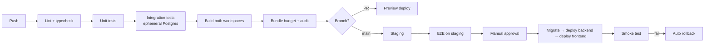

# Deployment

Environments, pipeline, and what to do when it breaks.

---

## 1. Environments

| Env | Frontend | Backend | Database | Purpose |
|---|---|---|---|---|
| Local | `vite dev` :5173 | `tsx watch` :4000 | Docker Postgres + Redis | Development |
| Preview | Pages preview URL | Per-PR backend | Shared branch DB | PR review |
| Staging | `staging.svhomeproducts.com` | Staging service | Production-shaped, anonymised | Pre-release verification |
| Production | `svhomeproducts.com` | Production service | Managed, PITR | Live |

**Staging uses Razorpay test keys. Production uses live keys. There is no
environment where these mix.**

Staging data is a restored production dump with PII anonymised — names, phones,
emails, addresses replaced. Realistic shape, no real customer data on a box
with looser access.

---

## 2. Local development

```bash
npm install                      # workspace root — installs all three
docker compose up -d             # postgres + redis
npm run db:migrate -w backend
npm run db:seed -w backend
npm run dev                      # frontend :5173 + backend :4000 concurrently
```

Vite proxies `/api` → `localhost:4000` in dev, so the frontend uses the same
relative URLs as production. No environment-specific base URL, no CORS branch
that only exists in development.

`.env` files: `frontend/.env.local` (`VITE_` only, all public),
`backend/.env` (everything sensitive).

---

## 3. Hosting

| Component | Service | Why |
|---|---|---|
| Frontend | Cloudflare Pages | Static at the edge, effectively free, instant rollback |
| CDN / WAF / rate limit | Cloudflare | Same zone as Pages, one place for routing rules |
| Backend | Render or Railway (Mumbai) | Long-lived Node process, simple scaling, no Kubernetes |
| Postgres | Neon or Supabase (Mumbai) | Managed backups, PITR, pooled connection string |
| Redis | Upstash or provider add-on | Cache + queue |
| Object storage | Cloudflare R2 | No egress fees, same edge as the CDN |

**Everything in `ap-south-1` / Mumbai.** Customers and warehouse are in India;
a US-hosted database adds ~200ms to every query for no benefit.

### The routing decision that matters

Cloudflare serves `svhomeproducts.com` from Pages and routes `/api/*` to the
backend origin. **One apex domain for both.**

This is not cosmetic. It means no CORS anywhere, and it means auth cookies can
be `SameSite=Lax` instead of the `SameSite=None` that an `api.` subdomain
would force — materially better CSRF posture, for free.

---

## 4. CI/CD



**Order matters on production deploy:** migrate, then backend, then frontend.
The database must accept what the new backend writes, and the backend must
serve what the new frontend requests. Reverse the order and you get a window
where the frontend calls endpoints that do not exist yet.

This works only because migrations are backwards-compatible
([DATABASE.md §5](./DATABASE.md)) — the old backend must keep running against
the new schema during the rollout.

Gates that fail the build: any lint error, any type error, test coverage below
80%, `npm audit` high/critical, storefront bundle over 200KB gzipped, a
detected secret.

Manual approval before production is deliberate. Continuous deployment to a
system that moves money is a decision to make later, with more test coverage
and a stronger reason than convenience.

---

## 5. Environment variables

**`frontend/` — all public, all in the bundle:**
```
VITE_API_URL=/api
VITE_RAZORPAY_KEY_ID=rzp_live_xxx
VITE_SENTRY_DSN=
```

**`backend/` — never public:**
```
NODE_ENV  PORT  DATABASE_URL  DATABASE_REPLICA_URL  REDIS_URL
RAZORPAY_KEY_ID  RAZORPAY_KEY_SECRET  RAZORPAY_WEBHOOK_SECRET
JWT_SECRET  JWT_REFRESH_SECRET
R2_ACCOUNT_ID  R2_ACCESS_KEY_ID  R2_SECRET_ACCESS_KEY  R2_BUCKET  R2_PUBLIC_URL
SMTP_URL  WHATSAPP_API_KEY  SHIPROCKET_EMAIL  SHIPROCKET_PASSWORD
ADMIN_ALERT_EMAIL  SENTRY_DSN  APP_URL
```

Validated with Zod **at boot**. A missing `RAZORPAY_KEY_SECRET` must crash on
startup with a clear message, not surface as a confusing 500 during someone's
first checkout.

Delete `GEMINI_API_KEY` from `.env.example` — leftover from the AI Studio
scaffold, referenced by nothing.

---

## 6. Zero-downtime deploys

- **Rolling.** New instances pass readiness before old ones drain.
- **Graceful shutdown:** on `SIGTERM`, stop accepting connections, finish
  in-flight requests (30s cap), close the DB pool, exit. Without this, every
  deploy drops the requests that were mid-flight — including checkouts.
- **Workers** finish their current job before exiting. BullMQ returns
  unfinished jobs to the queue.
- **Frontend** is atomic on Pages — a deploy either fully lands or does not.

---

## 7. Rollback

| What | How | Time |
|---|---|---|
| Frontend | Pages: promote the previous deploy | < 1 min |
| Backend | Redeploy the previous image | ~3 min |
| Migration | **Fix forward.** Never roll back a migration that touched live data. | Varies |
| Config | Revert the env var, restart | ~2 min |

The migration row is the one that requires discipline under pressure. Rolling
back a schema change against data written by the newer code loses that data.
Write a corrective migration instead — always.

---

## 8. Runbooks

### Site down
1. Cloudflare status, then the backend host's status page — is it yours?
2. `/api/health` directly against the origin, bypassing the CDN
3. Instance logs for crash loops
4. Database connectivity and connection count
5. If a recent deploy is implicated, roll back first and diagnose after

### Checkout failing
1. Razorpay status page
2. `payment_verification_failures` metric — signature problem or gateway
   problem?
3. Confirm live keys are set and not test keys
4. Confirm the webhook endpoint is reachable from outside
5. Interim: switch checkout to COD + WhatsApp so orders keep arriving

### Database at connection limit
1. `SELECT count(*) FROM pg_stat_activity`
2. Look for long-running or idle-in-transaction queries and terminate them
3. Confirm PgBouncer is in the path and the app pool is small (5–10)
4. Reduce API instance count temporarily if needed

### Queue backed up
1. Which queue, and is it draining or growing?
2. Is the third party down? Jobs will retry — that may be correct behaviour.
3. Scale workers up
4. Confirm failed jobs are not stuck in a retry loop with a permanent error

### Payment taken but no order
Highest-severity incident. See [PAYMENTS.md §10](./PAYMENTS.md).
1. Find the payment in the Razorpay dashboard
2. Check `webhook_events` — delivered? processed? errored?
3. Replay from the stored payload, or create the order manually
4. Contact the customer the same day
5. Fix the root cause before closing

---

## 9. Launch checklist

**Infrastructure**
- [ ] Domain, DNS, TLS, HSTS
- [ ] Cloudflare routing: Pages + `/api/*` → origin
- [ ] Postgres with PITR; a restore has been tested
- [ ] Redis reachable, workers consuming
- [ ] R2 bucket, CDN mapping, images uploaded

**Application**
- [ ] Migrations applied, catalogue seeded, opening stock set per variant
- [ ] Admin owner account created, 2FA enabled
- [ ] Real WhatsApp number replacing the `919876543210` placeholder
- [ ] Coupons migrated out of the frontend bundle into the database
- [ ] Seeded demo cart and wishlist removed from `ShopContext`
- [ ] Product detail routing bug fixed (see [MIGRATION.md](./MIGRATION.md))

**Payments** — see [PAYMENTS.md §12](./PAYMENTS.md)
- [ ] Live keys, webhook registered, ₹1 live test placed and refunded
- [ ] Reconciliation job scheduled

**Compliance** — see [COMPLIANCE.md](./COMPLIANCE.md)
- [ ] FSSAI number displayed, GSTIN on invoices
- [ ] Privacy, T&C, refund, and shipping policies live and linked
- [ ] Legal Metrology declarations on every product page

**Operations**
- [ ] External uptime checks, alerts routed to a phone
- [ ] Sentry live on both sides
- [ ] Daily business digest arriving
- [ ] Backups verified
- [ ] Load test passed, including the concurrent-stock case

**Go / no-go:** every payment and compliance box. The rest can follow.
