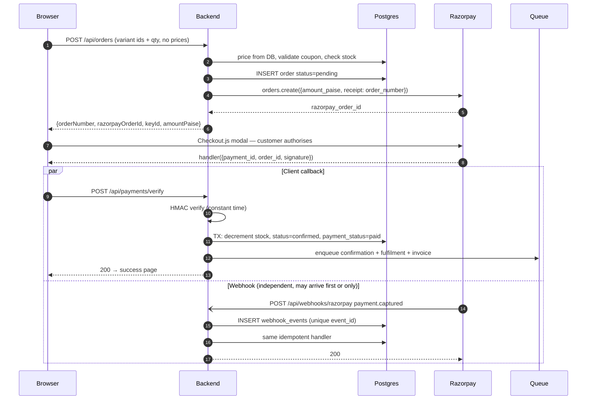

# Payments

Razorpay integration. This is the part of the system where mistakes cost money
rather than time — read it fully before touching payment code.

---

## 1. Why Razorpay

Domestic INR collection needs a gateway with RBI authorisation and UPI
support. Razorpay covers UPI (the dominant method for Indian D2C), cards,
net banking, and wallets, with a usable dashboard and reliable webhooks.

Stripe does not meaningfully serve domestic Indian payments. PhonePe PG and
Cashfree are legitimate alternatives; the integration shape in this document
is nearly identical for all of them.

**Fees:** ~2% + GST on the fee for UPI/cards. COD has no gateway fee but a
courier COD handling fee and a materially higher return rate.

---

## 2. Prerequisites — start these first

Razorpay KYC takes **2–5 working days** and blocks going live. It is paperwork,
not engineering, so it should be in flight before the payment code is written.

Required: GST registration, FSSAI licence (food category), a current account
in the business name, PAN, and address proof. See
[COMPLIANCE.md](./COMPLIANCE.md).

Test mode works immediately with `rzp_test_` keys. Build and test the entire
flow against test mode; only the key values change at go-live.

---

## 3. Keys

| Key | Where it lives | Public? |
|---|---|---|
| `RAZORPAY_KEY_ID` | Backend env; returned to the browser in the order response | **Yes** — safe in the bundle |
| `RAZORPAY_KEY_SECRET` | Backend env only | **No** — never leaves the server |
| `RAZORPAY_WEBHOOK_SECRET` | Backend env only | **No** |

The key id is public by design; the checkout widget needs it. The secret signs
and verifies payments — if it leaks, anyone can forge a successful payment
signature and take your inventory for free. It must never appear in a
`VITE_`-prefixed variable, a frontend build, a log line, or an error message.

---

## 4. The flow



### Why both the callback and the webhook

They are not redundant — they cover different failures.

The **client callback** is fast, so the customer sees confirmation
immediately. It is also unreliable: customers close the tab, lose signal on
mobile data, or background the browser mid-redirect. Roughly **1 in 20
successful payments never delivers its callback.**

The **webhook** is Razorpay calling your server directly. It always arrives
(with retries), but it can lag by seconds to minutes.

Rely on the callback alone and about 5% of paid orders are never recorded —
money in your account with no order attached, discovered only when a customer
complains. Rely on the webhook alone and the customer stares at a spinner.

**Both paths call the same idempotent service function.** Whichever arrives
first does the work; the second is a no-op.

---

## 5. Idempotency — three layers

Duplicate processing is the default state of payment systems, not an edge case.

1. **Database constraint.** `orders.razorpay_payment_id` is `UNIQUE`. A second
   attempt to attach the same payment fails at the database. This is the layer
   that holds when application logic is wrong.
2. **Event log.** `webhook_events.event_id` is `UNIQUE`. Insert before
   processing; a conflict means "already seen", return 200.
3. **Application guard.** The handler re-reads the order inside the
   transaction and returns early if `payment_status = 'paid'`.

All three. Layers 2 and 3 make it fast and quiet; layer 1 makes it correct.

---

## 6. Signature verification

### Client callback

```
expected = HMAC_SHA256(razorpay_order_id + "|" + razorpay_payment_id, KEY_SECRET)
compare with crypto.timingSafeEqual against razorpay_signature
```

### Webhook

```
expected = HMAC_SHA256(RAW_REQUEST_BODY, WEBHOOK_SECRET)
compare with the X-Razorpay-Signature header
```

**Two rules that are violated constantly:**

**Use the raw body.** The webhook route must be mounted with
`express.raw({ type: 'application/json' })` *before* the global
`express.json()`. Parsing and re-serialising JSON changes whitespace and key
order, the HMAC no longer matches, and every webhook fails signature
verification. This is the most common Razorpay integration bug in existence.

**Compare in constant time.** `a === b` on a signature leaks timing
information. Use `crypto.timingSafeEqual`.

A payment is marked paid **only** after signature verification. Never on the
strength of the client saying so — the success handler runs in the customer's
browser and can be called by anyone with devtools open.

---

## 7. Amount integrity

The amount sent to Razorpay is computed **only** from database prices:

```
subtotal = Σ (variant.price_paise × qty)      -- from DB, at order time
discount = server-side coupon evaluation
shipping = server-side rule (free ≥ ₹499, else ₹60)
total    = subtotal − discount + shipping + tax
```

At verification, re-fetch the Razorpay payment and assert
`payment.amount === order.total_paise`. If they differ, do not fulfil — flag
for manual review. A mismatch means either a bug or tampering, and both
warrant a human.

---

## 8. Cash on Delivery

COD is a large share of Indian D2C orders and needs its own handling.

- No gateway involvement. Order goes straight to `confirmed`, stock decrements
  immediately.
- **Higher risk:** RTO (return to origin) rates of 15–30% are normal. Each RTO
  costs two-way shipping on a sale that never happened.
- Mitigations worth building, in order of value:
  - Phone OTP verification before accepting a COD order — the single most
    effective filter
  - COD cap (e.g. orders above ₹2,000 are prepaid only)
  - Pincode allowlist based on courier COD serviceability
  - Track RTO rate per pincode; disable COD where it exceeds a threshold
- Charge a small COD handling fee, waived on prepaid, to nudge prepaid.

Stock is decremented on a COD order like any other. RTO restores it — through
the same single stock-mutation function.

---

## 9. Refunds

- Initiated from the admin panel, `owner` role only, always against an
  `order_number`.
- Full or partial (partial for a single damaged item in a multi-item order).
- Razorpay refunds return to the original payment method in 5–7 working days.
  Say this in the customer notification — it prevents most "where is my
  refund" tickets.
- COD refunds are a manual bank transfer. The admin records the UTR against
  the order.
- `refund.processed` webhook updates `payment_status`.
- **Restore stock on refund**, unless the return was for damage — a damaged
  packet does not go back on the shelf. The admin chooses; the default is
  restock.

---

## 10. Reconciliation

Trust nothing. Run a nightly job:

1. Fetch all Razorpay payments for the previous day
2. Match against `orders` by `razorpay_payment_id`
3. Report three categories:
   - **Payment with no order** — money taken, nothing recorded. Highest
     severity. Almost always a webhook that failed while the customer's tab
     was closed. Create the order manually and fix the cause.
   - **Order marked paid with no Razorpay payment** — a bug in verification.
     Serious.
   - **Amount mismatch** — a pricing bug or tampering.
4. Email the report to the owner even when clean. A silent job is a job nobody
   notices has been broken for three weeks.

Also sweep `pending` orders older than 30 minutes: check their real status
with Razorpay, then either promote to confirmed or mark failed and release any
reservation.

---

## 11. Testing

Never against live keys.

| Case | Expectation |
|---|---|
| Successful UPI (test mode) | Order confirmed, stock down, email queued |
| Failed payment | Order `failed`, **stock unchanged** |
| Customer closes tab after paying | Webhook alone confirms the order |
| Webhook delivered twice | Second is a no-op, no double stock decrement |
| Webhook arrives before callback | Callback is a no-op, returns the same success |
| Tampered signature | 400, order stays pending, `warn` logged |
| Amount mismatch | Not fulfilled, flagged for review |
| 200 concurrent orders on a variant with 50 stock | Exactly 50 succeed. Never 51. |
| Refund | Status updated, stock restored, customer notified |

The concurrency case is the important one. Run it in CI. If it ever produces
51, stop all other work — overselling costs a customer, a refund, and a
public review.

---

## 12. Going live

- [ ] Razorpay KYC approved, live keys issued
- [ ] Webhook URL registered in the Razorpay dashboard, secret in backend env
- [ ] Webhook events subscribed: `payment.captured`, `payment.failed`,
      `refund.processed`, `order.paid`
- [ ] One real ₹1 transaction end-to-end on production, then refunded
- [ ] Settlement account verified, settlement cycle understood (T+2 default)
- [ ] Reconciliation job scheduled and its first report received
- [ ] Refund policy page live and linked from checkout — Razorpay requires it
- [ ] Test keys removed from every environment that is not local
